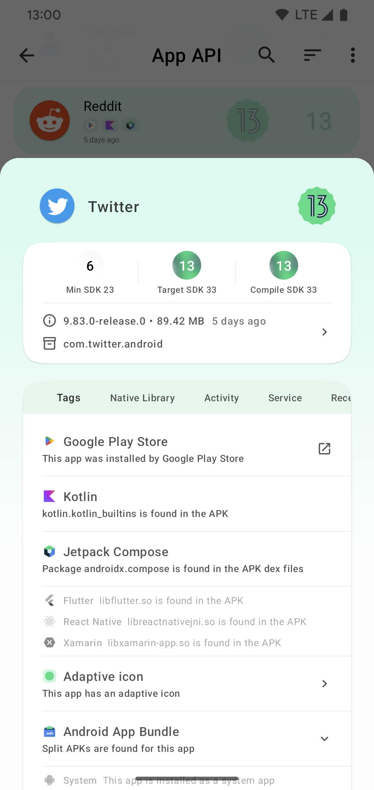
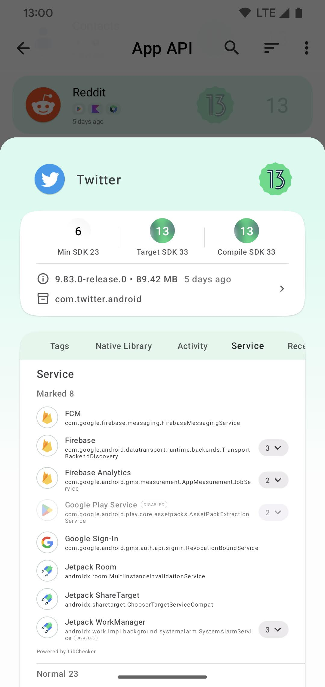

  
  
  

# Boundo Meta-app: Info & Manager

Boundo Meta-app is all about your apps and beyond.  
Check info of apps on your phone, and organize them into categories.  
Designed for Android enthusiasts, Meta-app is available on **Android** and **Wear OS**.

### 1. Develop
**1.1 Requirements**
- Android Studio `Meerkat` (AGP `8.9`)
- Java `17`, Kotlin `2.1.20`, Gradle `8.13`

**1.2 Configure automatic signing**
- **Copy** the file named `custom.properties.template` in `doconfig` directory,
  **rename** it to `custom.properties` and make necessary **change**s to it

**1.3 Build universal APKs (App API feature included, release variant)**
- Configure signing as specified in section 1.2
- Download BundleTool binary from [BundleTool Releases](https://github.com/google/bundletool/releases),
  and save it as `doconfig/bundletool.jar` in this project
- Run Gradle task from commandline `gradlew :app:genUniversalApks`
- Look for `app/build/outputs/app-universal-release.apks` in this project

**1.4 Build FOSS version (less feature)**
- Run Gradle task from commandline `gradlew :app:bundleFoss`
- Look for `app/build/outputs/bundle/foss/app-foss.aab` in this project
- Generate universal apks from `app-foss.aab` using BundleTool

### 2. Download

