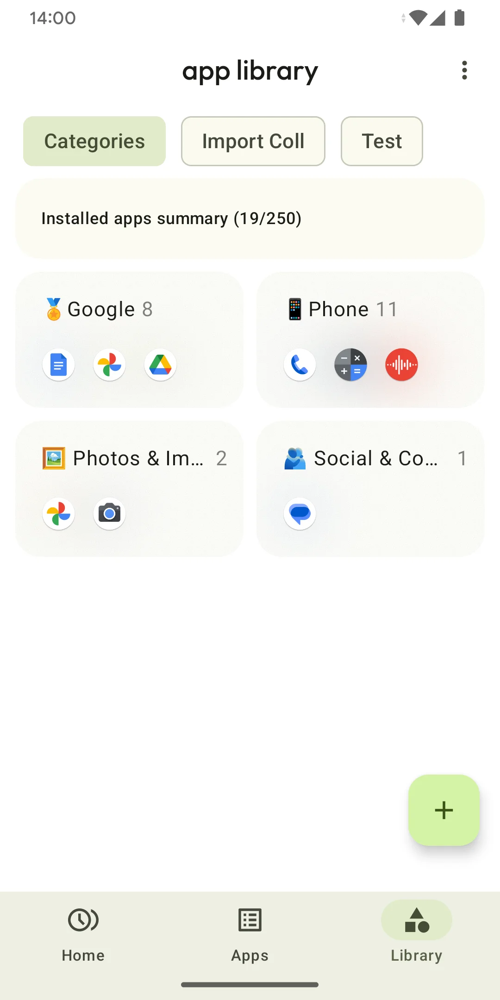

<p align="center">
  
  
  
  
</p>

# Boundo Meta-app: Info & Manager

Boundo Meta-app is all about your apps and beyond.  
Check info of apps on your phone, and organize them into categories.  
Designed for Android enthusiasts, Meta-app is available on **Android** and **Wear OS**.

### 1. Develop
**1.1 Requirements**

1.1.1 Versions
- Android Studio `Narwhal` (AGP `8.11`)
- Java `17`, Kotlin `2.1.21`, Gradle `8.13`

1.1.2 Configure project JDK for Android Studio
- Open the Gradle settings from **Settings > Build, Execution, Deployment > Build Tools > Gradle**
- From the **Gradle JDK** drop-down, select `GRADLE_LOCAL_JAVA_HOME`
- A new drop-down appears under it, select a JDK of the required version
- Note that this setting does not affect commandline/CI use, refer [Java versions in Android builds](https://developer.android.com/build/jdks) for more information

**1.2 Configure signing & BundleTool**
- **Copy** the file named `custom.properties.template` in `doconfig` directory,
  **rename** it to `custom.properties` and make necessary **change**s to it
- Download BundleTool binary from [BundleTool Releases](https://github.com/google/bundletool/releases),
  and save it as `doconfig/bundletool.jar` in this project

**1.3 Build universal APKs (App API feature included, release variant)**
- Follow section 1.2: configure signing & BundleTool
- Run Gradle task from commandline `gradlew :app:genUniversalApks`
- Look for `app/build/outputs/app-universal-release.apks` in this project

**1.4 Build FOSS version (less feature)**
- Follow section 1.2: configure signing & BundleTool
- Run Gradle task from commandline `gradlew :app:genFossApks`
- Look for `app/build/outputs/app-universal-foss.apks` in this project

**1.5 Commandline build environment**

1.5.1 Configure project JDK for commandline
- Edit file `gradle.properties` in project root, add the `org.gradle.java.home` property to the file, example like below
  ```org.gradle.java.home=/Users/cliuff/Library/Java/jdk-17.0.2.jdk/Contents/Home```

1.5.2 Configure Android SDK
- Install Android Studio, finish setup wizard and get Android SDK path
- Create or edit file `local.properties` in project root, add the `sdk.dir` property to the file, example like below
  ```sdk.dir=/Users/cliuff/Library/Android/sdk```

1.5.3 Build universal APKs
- Refer previous sections for steps to build APKs

### 2. Download
[](
https://play.google.com/store/apps/details?id=com.madness.collision&pcampaignid=pcampaignidMKT-Other-global-all-co-prtnr-py-PartBadge-Mar2515-1)
