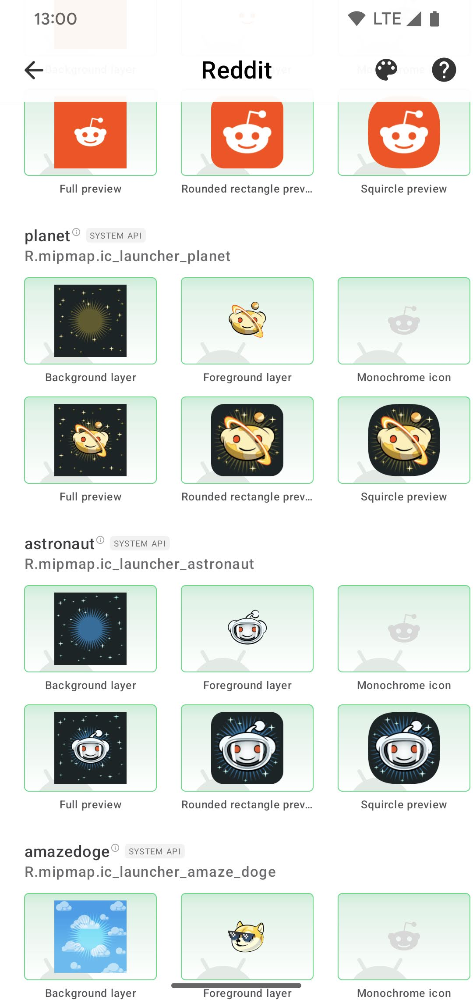

  
  
  

# Boundo: App API Checker

**Requirements**
- Android Studio `Flamingo Patch 2` (AGP `8.0.2`)
- Gradle Wrapper `8.2.1`
- Java `11`
- Kotlin `1.8.22`
- Jetpack Compose Compiler `1.4.8` (requires Kotlin `1.8.22`)

**After Git check-out**
- Clone project [**Apk Parser**](https://github.com/cliuff/apk-parser.git) into `subproject`, resulting in `ROOT_DIR/subproject/apk-parser`
- **Copy** the file named `custom.properties.template` in project root directory,
  **rename** it to `custom.properties` and make necessary **change**s to it

**After Gradle sync**
- Adjust **Run/Debug Configurations** settings
    - Open **Edit Run/Debug configurations** dialog
    - Click **Edit Configurations...**
    - Select configuration **boundo.app**
    - Locate **deploy** under **Installation Options**
    - Change the configuration to **APK from app bundle**
- Adjust **Build Variants** settings
    - Open **Build Variants** tool window
    - Change the **Active Build Variant** of module **boundo.app** to **fullDebug**
    - Change the **Active Build Variant** of module **boundo.wearable** to **fullDebug**

**Attention**
- As a standalone project, `apk-parser` may need to be built independently after code changes in that module,  
  by clicking window menu item "Build" -> "Make module boundo.apk-parser",
  otherwise changes may not take effect immediately.
